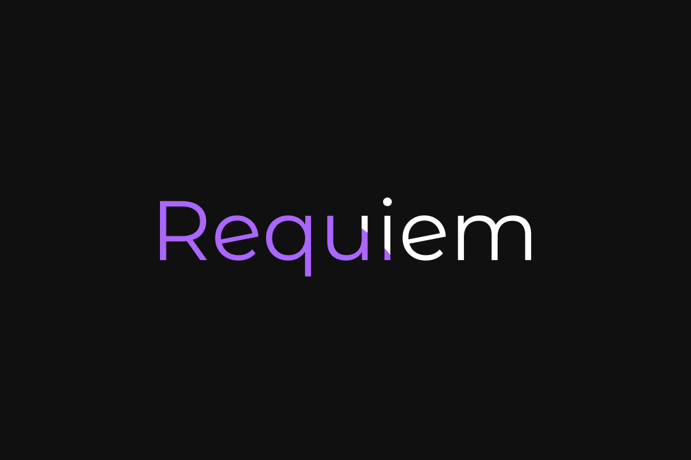

Welcome to **RequiemTeam**, a development group currently working on **Requiem Client**, an advanced Minecraft cheat designed to enhance gameplay with powerful features and a modern GUI.

## 🚧 Requiem Client (In Development)
**Requiem Client** is a Minecraft 1.16.5 Fabric-based cheat client featuring:
- 🌟 **Modern GUI** – Sleek, customizable, and easy to navigate
- 🗂 **Multiple Tabs** – Organized dropdown menu layout for better usability
  
## 🔨 Development Status
Requiem Client is currently in active development. Features and enhancements are being added regularly. Stay tuned for updates!

## 📌 Roadmap
- [✅] Basic Cheat Modules (ESP, Aimbot, AutoClicker, etc.)
- [✅] Config System
- [✅] Keybind Customization
- [ ] Enhanced Anti-Cheat Bypass

## 🤝 Contributing
We welcome contributions! Feel free to submit issues, feature requests, or pull requests.

## 📢 Stay Updated
Follow the repository and join our community for updates and discussions.

---
🚀 **Requiem – We're here to help you dominate.**
